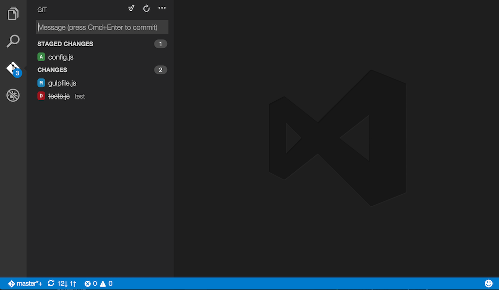
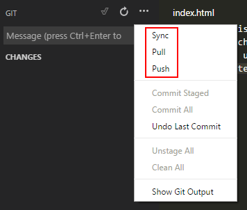

# Git 사용법 기본

## 설치

https://git-scm.com/ 에 접속하여 다운로드 받고 설치합니다.
설치 옵션은 기본을 그대로 사용합니다.

## 저장소 다운받기

최초 한번 저장소를 다운(clone) 받아야 합니다. `Git`을 설치 후 바탕화면에서 오른쪽 버튼을 누르고 `Git GUI Here`를 선택합니다.
`Clone Existing Repository`를 선택하고 `Source Location`에 Git 저장소 주소를 적고 `Target Directory`에 다운받을 폴더 위치를 선택합니다.
`Target Directory`는 존재하지 않는 폴더여야 합니다. 예를 들어 `C:\Workspace\soohwarim`에 다운받고 싶다면 `C:\Workspace` 폴더는 있지만 `C:\Workspace\soohwarim`는 없어야 합니다.
이름/암호 입력란이 나오면 입력합니다.

## code editor 사용

code editor는 microsoft에서 만든 에디터로 git을 사용하기 가장 쉽습니다.

https://code.visualstudio.com/ 에 접속하여 다운로드 받고 설치합니다.
git은 다양한 기능이 있지만 여기서는 저장(commit)하고 서버에 전송(push)하고 최신버전을 다운(pull) 받는 3가지 작업만 수행합니다.

## code editor 에서 git 사용하기

VisualStudioCode 에디터에서 왼쪽 메뉴 3번째를 선택하면 git 작업을 할 수 있습니다.
파일을 아무거나 수정한 후 저장하면 파일이 수정되었다는 메시지를 볼 수 있습니다. 추가 / 수정 / 삭제에 대한 정보를 볼 수 있습니다.

현재 상태를 저장하려면 메시지 입력창에 메시지를 적고 "ex)메인 페이지 수정" Ctrl+Enter를 누르면 저장됩니다.
저장된 상태는 로컬 PC에만 저장된 것으로 최종적인 작업이 완료되면 서버로 전송해야 합니다.

메시지 입력창 위에 `...`을 누르면 `Push` 명령어가 보이고 누르면 서버로 전송을 합니다.

나중에 서버에 다른 사람이 수정을 하면 `Pull`을 받으면 최신 소스를 다운 받게 됩니다. 다운 받기 전에는 반드시 저장(commit)을 해야 하며,
다운받을때 로컬에서 작업한 내용이 사라지는 것이 아니라 수정된 부분이 자연스럽게 합쳐지게 됩니다.
